# Exno:1
Data Cleaning Process

# AIM
To read the given data and perform data cleaning and save the cleaned data to a file.

# Explanation
Data cleaning is the process of preparing data for analysis by removing or modifying data that is incorrect ,incompleted , irrelevant , duplicated or improperly formatted. Data cleaning is not simply about erasing data ,but rather finding a way to maximize datasets accuracy without necessarily deleting the information.

# Algorithm
STEP 1: Read the given Data

STEP 2: Get the information about the data

STEP 3: Remove the null values from the data

STEP 4: Save the Clean data to the file

STEP 5: Remove outliers using IQR

STEP 6: Use zscore of to remove outliers

# Coding and Output

[EXNO_1](EXNO1_DS.ipynb)

```python
import pandas as pd
import numpy as np
```

```python
#READ CSV FILE HERE
df = pd.read_csv("Loan_data.csv")
df
```
  

```python
#DISPLAY THE INFORMATION ABOUT CSV AND RUN THE BASIC DATA ANALYSIS FUNCTIONS
df.info()
```
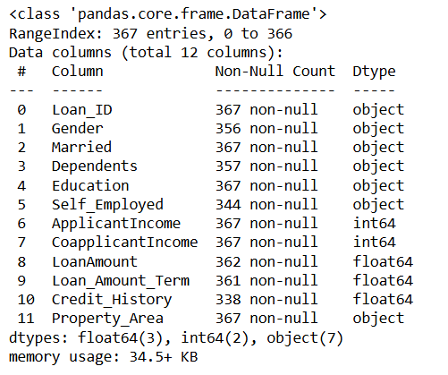  

```python
df.shape
```
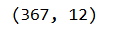  

```python
df.describe()
```
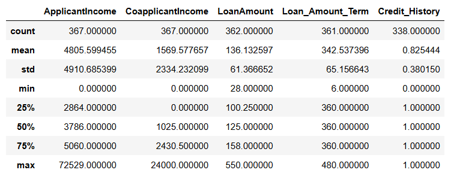  

```python
#CHECK OUT NULL VALUES IN DATA SET USING FUNCTION
df.isnull()
```
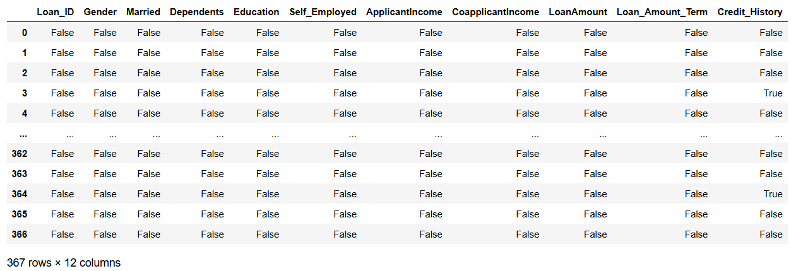  

```python
#DISPLAY THE SUM ON NULL VALUES IN EACH ROWS
df.isna().sum()
```
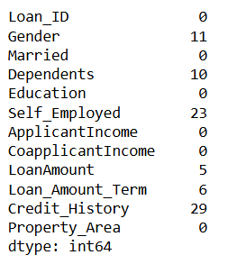  

```python
#DROP NULL VALUES
dropped_df = df.dropna()
dropped_df
```
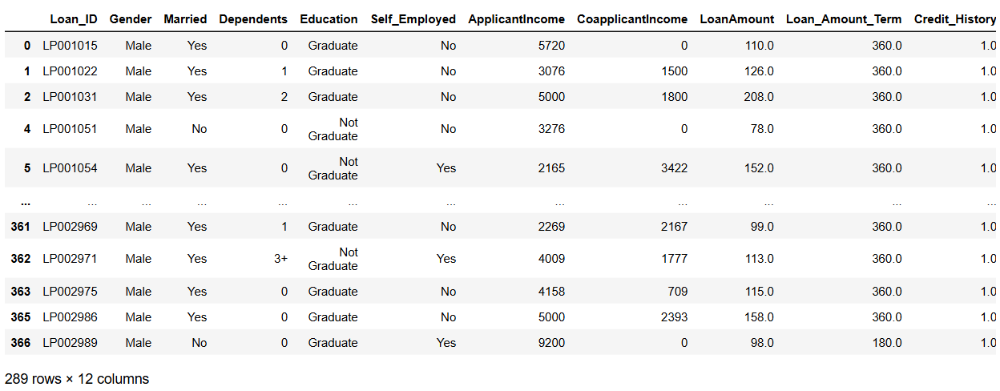  

```python
#FILL NULL VALUES WITH CONSTANT VALUE "O"
filled_df = df.fillna(0)
filled_df
```
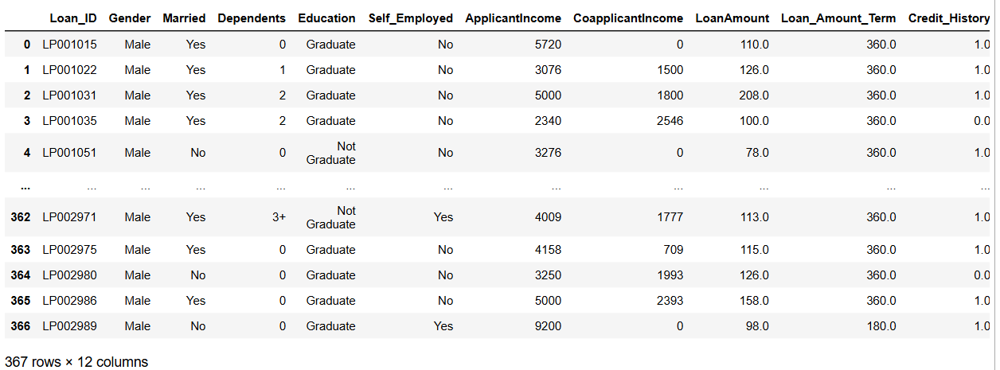  

```python
#FILL NULL VALUES WITH ffill or bfill METHOD
ffilled_df = df.fillna(method="ffill")
ffilled_df
```
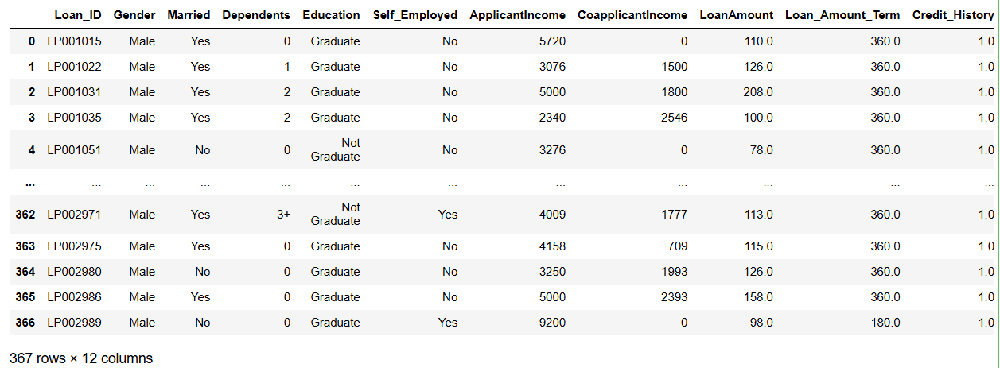  

```python
bfilled_df = df.fillna(method="bfill")
bfilled_df
```
  

```python
#CALCULATE MEAN VALUE OF A COLUMN AND FILL IT WITH NULL VALUES
new_df = df
new_df["LoanAmount"] = df["LoanAmount"].fillna(df["LoanAmount"].mean())
new_df["Loan_Amount_Term"] = df["Loan_Amount_Term"].fillna(df["Loan_Amount_Term"].mean())
new_df.isna().sum()

```
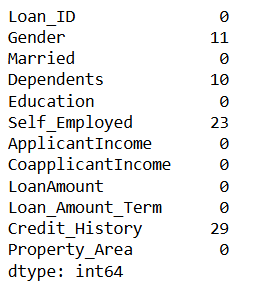  

```python
#DROP NULL VALUES
new_df.dropna(axis=0, inplace=True)
new_df
```
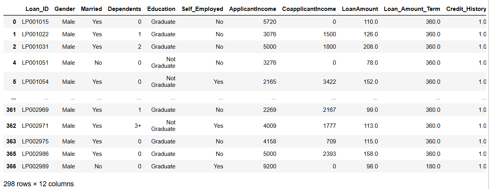  

```python
import pandas as pd
import seaborn as sns
```

```python
age=[1,3,28,27,25,92,30,39,40,50,26,24,29,94]
af=pd.DataFrame(age)
af
```
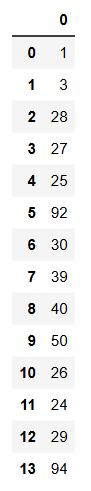  
 
```python
#USE BOXPLOT FUNCTION HERE TO DETECT OUTLIER
sns.boxplot(data=af)
```
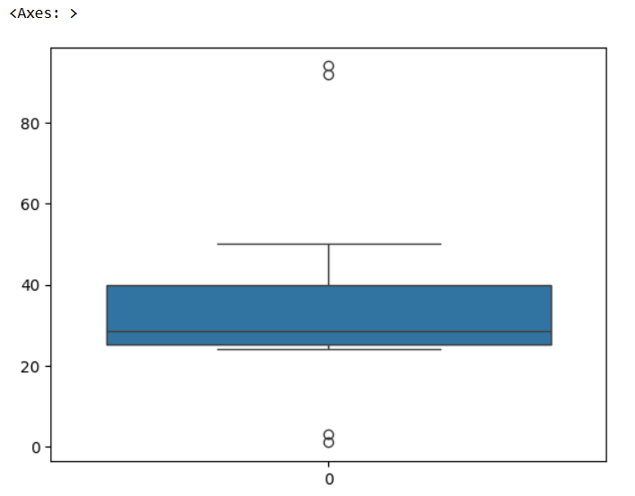  

```python
#PERFORM IQR METHOD AND DETECT OUTLIER VALUES
Q1 = np.percentile(age, 25)
Q3 = np.percentile(age, 75)
IQR = Q3 - Q1
lower_bound = Q1 - 1.5 * IQR
upper_bound = Q3 + 1.5 * IQR

print(f"Quartile-1 : {Q1}")
print(f"Quartile-3 : {Q3}")
print(f"IQR : {IQR}")
print(f"Lower Bound : {lower_bound}")
print(f"Upper Bound : {upper_bound}")
```
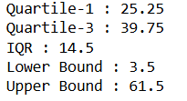  

```python
#REMOVE OUTLIERS
af = af[(af >= lower_bound) & (af <= upper_bound)]
```

```python
#USE BOXPLOT FUNCTION HERE TO CHECK OUTLIER IS REMOVED
sns.boxplot(data=af)
```
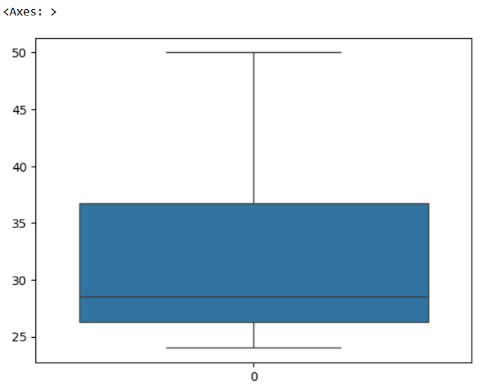  

```python
from scipy.stats import zscore #STATS METHOD IS USED TO IMPLEMENT Z SCORE METHOD
```

```python
data=[1,12,15,18,21,24,27,30,33,36,39,42,45,48,51,54,57,60,63,66,69,72,75,78,81,84,87,90,93,96,99,158]
df=pd.DataFrame(data)
```

```python
#USE BOXPLOT FUNCTION HERE TO DETECT OUTLIER
sns.boxplot(data=df)
```
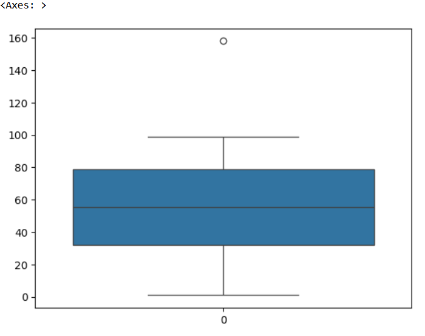  

```python
#PERFORM Z SCORE METHOD AND DETECT OUTLIER VALUES
z_score = np.abs(zscore(df))
threshold = 3
```

```python
#REMOVE OUTLIERS
outliers = df[z_score>3]
print(outliers)
cleaned_df = df[z_score<3]
print(cleaned_df)
```

```python
#USE BOXPLOT FUNCTION HERE TO CHECK OUTLIER IS REMOVED
sns.boxplot(data=cleaned_df)
```
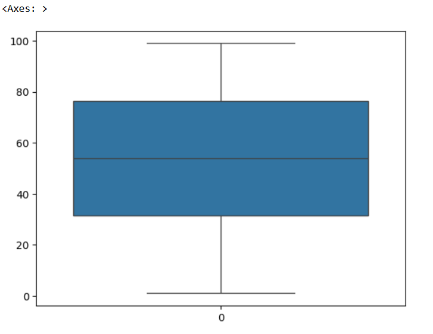  

# Result
          Thus the data has been cleaned successfully.
